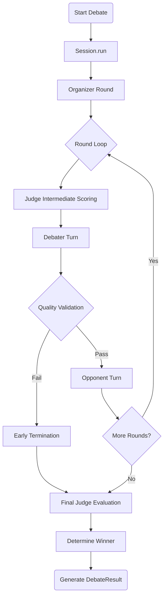

# Multi-Participant AI Debate Platform

A software platform for orchestrating debates between Large Language Models (LLMs). The system includes logic for argument validation, evidence-based scoring, and multi-round interactions. It supports various LLM providers through the **litellm** library.

## Architecture

### Visual Overview



### Participant Roles

1. **Organizer**: Generates a neutral topic overview (200-300 words).
2. **Supporter**: Argues in favor of the topic.
3. **Opposer**: Argues against the topic.
4. **Judge**: Evaluates arguments based on defined metrics and provides a final score.

Participants can be configured with different LLM models.

## Why Debating Can Help LLMs?

Debating provides an adversarial environment that requires models to analyze, refute, and adapt to external logic.

### (1) Between Two Different Models
Debating between models from different providers (e.g., GPT-4 vs. Claude-3) allows for the identification of provider-specific biases and knowledge gaps. It serves as a cross-validation mechanism where the strengths of one architecture can be used to expose the logical inconsistencies or factual errors of another.

### (2) Between the Same Models
Assigning different roles (Supporter vs. Opposer) to the same model facilitates internal consistency testing. This configuration requires the model to explore conflicting perspectives within its own training data, which can be used to evaluate its ability to follow complex personas and identify self-contradictions in its reasoning processes.

### Debate Flow

- **Round 0**: Topic introduction by the Organizer.
- **Rounds 1-N**: Alternating arguments between Supporter and Opposer.
  - Models receive context including previous arguments from both sides.
  - Models are prompted to identify logical gaps and rebut opponent claims.
- **Evaluation**: The Judge scores the debate using the following criteria:
  - Argument Quality (0-10)
  - Evidence Quality (0-10)
  - Logical Consistency (0-10)
  - Responsiveness to Gaps (0-10)
  - Overall Score (0-10)

## Design Characteristics

The platform implements the following logic:

- **Validation Logic**: Automated checks to terminate debates if argument quality falls below a threshold or becomes repetitive.
- **Weighted Scoring**: Evidence quality is assigned a 40% weight in the final evaluation.
- **Dynamic Adjustments**: Scoring includes bonuses for acknowledging valid opponent points and penalties for unaddressed weaknesses.
- **Orchestration**: A core engine (`src/debate`) manages the state machine and participant interactions independently of the interface.

## Core Features

- **Automated Termination**: Ends the session if arguments lack novelty or fail to address the topic.
- **Evidence Weighting**: Prioritizes factual citations in the scoring rubric.
- **Strategy Adaptation**: Debaters receive intermediate scores to adjust their argumentation in subsequent rounds.
- **Multi-Model Integration**: Compatible with 20+ LLM providers via litellm.
- **Deployment Interfaces**: Includes a Streamlit web UI, a CLI, and a Python API.
- **Data Export**: Debate transcripts are available in JSON format with metadata.

## Setup

### Prerequisites

- Python 3.8+
- API keys for LLM providers (e.g., OpenAI, Anthropic, Google).
- [Ollama](https://ollama.ai/) for local model execution (optional).

### Installation

```bash
git clone https://github.com/csv610/AIDebator.git
cd AIDebator
pip install -r requirements.txt
```

### Configuration

Create a `.env` file in the project root:

```env
OPENAI_API_KEY=your_key
ANTHROPIC_API_KEY=your_key
```

## Usage

### Interfaces

**Web Interface**
```bash
streamlit run app.py
```

**Command Line**
```bash
python debate_cli.py --topic "Subject" --rounds 3
```

**Python API**
```python
from src.debate import DebateConfig, DebateSession

config = DebateConfig(
    topic="Topic",
    organizer_model="gpt-4",
    supporter_model="gpt-4",
    opposer_model="claude-3",
    judge_model="gpt-4",
    num_rounds=3
)

debate = DebateSession.from_config(config)
result = debate.run(num_rounds=config.num_rounds)
```

## Implementation Details & Limitations

### Implementation Features

- **Type Safety**: Uses Python type hints across the codebase.
- **Modular Design**: Separation of engine logic, data models, and participant behavior.
- **State Serialization**: Support for JSON-based configuration and result persistence.

### Constraints

- **LLM-Dependent Validation**: The accuracy of quality validation is tied to the performance of the judge model.
- **Synchronous Execution**: API calls are made sequentially, which impacts total execution time.
- **Context Window Limits**: Long debates may be constrained by the token limits of the selected models.
- **Fixed Roles**: The current version is designed for a four-participant structure (1 Organizer, 2 Debaters, 1 Judge).

## Documentation

- **[Quick Start](docs/QUICKSTART.md)**
- **[Architecture](docs/ARCHITECTURE.md)**
- **[Scoring Methodology](docs/SCORING_GUIDE.md)**
- **[CLI Guide](docs/CLI_GUIDE.md)**
- **[File Index](docs/INDEX.md)**

## Data Models

- **DebateConfig**: Configuration parameters for the session.
- **Argument**: Metadata and content for individual turns.
- **Score**: Quantitative and qualitative evaluation data.
- **DebateTermination**: Records the reason and timing of session end.

## License

MIT License

## Citation

```
CSV610. (2025). AI Debate Platform: Multi-Participant AI Debate
with Quality Control and Evidence-Based Scoring.
https://github.com/csv610/AIDebator
```
